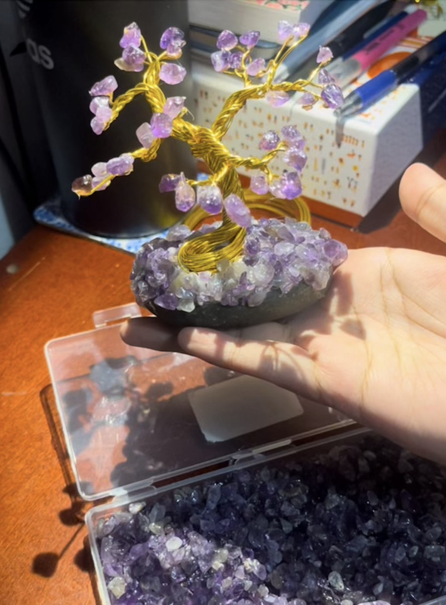

This page is where you can iterate. Follow the lab instructions in the [readme.md](./README.md).

# Oh why hello, friends! 👋

---

## Interesting Times

In a world full of **short-form content** and constant stimulation on the internet and our devices,  I like to indulge in the pleasures of <strong style="color:#A0522D;">offline hobbies</strong>.

Offline hobbies help me <strong>slow down</strong> the moment and reconnect with <strong>myself</strong> and <strong>my brain</strong>.

They improve my <strong>focus</strong>,  reduce <strong>stress</strong>,  and remind me that I have many <strong>physical outlets</strong> I can choose from to unleash my creativity.

---

##  Here are my favorite offline hobbies

<table>
  <tr>
    <th>Hobby</th>
    <th>Description</th>
  </tr>
  <tr>
    <td>Photography</td>
    <td>What better way to capture the moment and have something beautiful to look back on. I used to get annoyed at my Dad as a kid because he would take pictures of EVERYTHING... but now.. that's me. I do that. </td>
  </tr>
  <tr>
    <td>Painting</td>
    <td>Whether it's watercolor or acrylic markers, I love painting. I'm not good at sketching, so my primary method is blocking out colors to give shape to my vision. It's a good day to know color theory. Otherwise, I will trace out my inspiration and give it life with watercolor. </td>
  </tr>
  <tr>
    <td>Junk Journaling</td>
    <td>I guess, a creative, more organized way to my already hoarding tendencies? But I get to tape and glue my meaningful scrap onto the page and make a pretty collage out of it. Great way to reference memories and look back on happy times. I also kind of scrapbook, where I find cool parts of magazines, newspaper, mail, whatever I can get my hands on, and make a collage our of that or jus have cool pieces to add to my pages across the journal ecosystem that I have. </td>
  </tr>
    <tr>
    <td>Crafting</td>
    <td>Alright this one's a big category. I have pearler beads, which I use to create pixel art. I have seed beads, which I make biggg and smallllll flowers with. I want to learn more about beads, maybe embroider or make little animals out of them. I also like making shelves and mini storage compartments with cardboard. This stemmed from me not being able to find the perfect dimensions for shelves I wanted to put on my already small desk.</td>
  </tr>
</table>

---

##  Here are hobbies I want to pursue in the future 
### Can't do em all now, unfortunately
<ol>
  <li><strong>Felt Crafting</strong> – sewing and bright colors... want </li>
  <li><strong>Clay</strong> – making my own trinket with clay?!? Sign me up </li>
  <li><strong>Pipecleaner Flowers</strong> – so pretty but I have no space to keep my masterpieces. That's why I do a lot of little crafts.  </li>

</ol>

---

##  Here is my recent biggest achievment 

 I saw a $100 crystal tree in the mall and told my friend,
 

> "Are you crazy, I can make that myself for $3."

And I did, as per the image below 

 

<!-- {.center} 
mannnnnnnnn -->

<!-- ITS NOT CENTEREDDDD-->

<!--test commit 1-->
<!--test commit 2-->

oo i can put links
[Click Me I'm Safe](https://www.youtube.com/watch?v=d6x0KJ8T7Co)