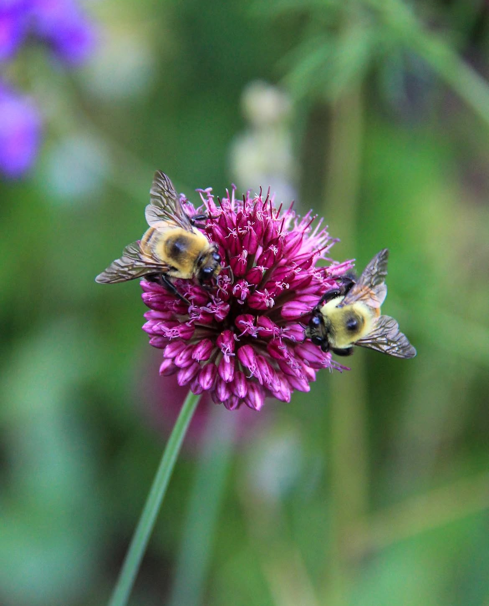

<!-- This page is where you can iterate. Follow the lab instructions in the [readme.md](./README). -->

# Welcome to Passing Pollinators (Lab #1)
## By Sidrat Habib
<br>

### Where we will: 
1. learn the basics of importing data and creating a basic dashboard
2. build a few Observable Plot options
3. start iterating with visualizations to answer data questions
<br>
<br>

### Context 
The local farm has some new observational data from their plots. They need our help to determine important trends about the bees and the flowers. They are hoping to know more about the three bee species observed, the flowers, and the ideal conditions. Specifically, our dashboard answers the following questions:
<br>
<br>


<br>

##### Photo Credits: Sidrat Habib

<br>
<br>
<br>

```js
// Load data
const beeData = FileAttachment("data/pollinator_activity_data.csv").csv({ typed: true })

// display -- this displayed something weird hmmm
// display(beeData)

// Create interactive table
Inputs.table(beeData)

// making a plot code
// Plot.plot({
//   marks: [
//     Plot.frame(),
//   ]
// })
```

<!-- Showing work down below -->


<!-- Q1 WORK -->
## Question # 1: What is the body mass and wing span distribution of each pollinator species observed?
```js
display(
  Plot.plot({
    title: "Average Body Mass by Species",
    x: { label: "Pollinator Species" },
    y: { label: "Average Body Mass (g)" },
    color: { legend: true },
    marks: [
      Plot.barY(
        beeData,
        Plot.groupX(
          { y: "mean" }, 
          {
            x: "pollinator_species",
            y: "avg_body_mass_g",
            fill: "pollinator_species",
            tip: true
          }
        )
      ),
      Plot.ruleY([0])
    ]
  })
)
```
### Body Mass Distribution: 
As seen in the bar chart above, in respective order from heaviest to lightest, the Carpenter Bee weighs **0.449g**, followed by the Bumblebee with a weight of **0.251g**, and finally, the Honeybee with a significantly light weight of **0.1g**. 
<br>
<br>

<!-- meow -->
```js
display(
  Plot.plot({
    title: "Wing Span by Species",
    width: 700,
    marginLeft: 120, // didn't fit, too phat (labesl were cut off)
    x: { 
      label: "Wing Span (mm)", 
      grid: true,
      ticks: 15   //needed more specificity 
    },
    y: { label: null },
    color: { legend: true },
    marks: [
      Plot.boxX(beeData, {
        x: "avg_wing_span_mm",
        y: "pollinator_species",
        fill: "pollinator_species",
        tip: true
      })
    ]
  })
)
```
### Wing Span Distribution: 
As shown in the box-and-whisker plot above, the body mass and overall size of the bees reflect the potential wing span of each bee, as well. From largest wingspan to smallest, we have the Carpenter Bee, followed by the Bumblebee, and Honeybee once again. Their respective values are **~39-45mm**, **~33-37mm**, and **~18-20mm**. 
<br>
<br>


<!-- Q2 WORK -->
## Question 2: What is the ideal weather (conditions, temperature, etc) for pollinating?

<!-- <div style="display: flex; gap: 20px; justify-content: center;">
<div> --> 
<!-- failed idea, tried to put chart side by side for comparison. guess we are stacking them. it worked for a sec but wouldn't display the viz, just raw js -->
```js
display(
  Plot.plot({
    title: "Temperature vs Pollinator Visits (Raw Data)",
    x: { label: "Temperature (°C)" },
    y: { label: "Visit Count" },
    marks: [
      Plot.dot(beeData, {
        x: "temperature",
        y: "visit_count",
        fill: "weather_condition",
        tip: true
      })
    ]
  })
)

display(
  Plot.plot({
    title: "Average Pollination Trend by Temperature",
    x: { label: "Temperature (°C)", grid: true },
    y: { label: "Average Visit Count", grid: true },
    marks: [
      Plot.line(
        beeData,
        Plot.binX(
          { y: "mean" },   
          {
            x: "temperature",
            y: "visit_count",
            tip: true
          }
        )
      ),
      Plot.ruleY([0])
    ]
  })
)
```
#### Note:
I originally made a scatterplot out of curiosity of how the data would spread out. I included a Trend Line for cleaner observation / a more averaged result that I could analyze and pull the data I need to come to a conclusion. 

### Temperature Relationship:
Pollinator visits increase as temperature rises, with activity growing from around **2–3** visits at lower temperatures **(~14–17°C)** to about **8–9** visits at higher temperatures (**~26–29°C)**, indicating that warmer conditions support greater pollination activity.<br> 
<br> 
<br>

```js
display(
  Plot.plot({
    title: "Average Visits by Weather Condition",
    x: { label: "Weather Condition" },
    y: { label: "Average Visit Count" },
    color: { legend: true },
    marks: [
      Plot.barY(
        beeData,
        Plot.groupX(
          { y: "mean" },
          {
            x: "weather_condition",
            y: "visit_count",
            fill: "weather_condition",
            tip: true
          }
        )
      ),
      Plot.ruleY([0])
    ]
  })
)
```
### Weather condition: 
Pollinator activity varies by weather condition, with cloudy conditions showing the highest average visits **(~6.2)**, followed by partly cloudy **(~5.3)** and sunny conditions **(~4.6)**, suggesting that bees are most active under less direct sunlight.
<br>
<br>

## Overall
Pollination activity increases with temperature and varies by weather condition. At lower temperatures **(~14–17°C)**, average visit counts are around **2.8** visits, while at higher temperatures **(~26–29°C)**, visits rise to about **8.9** visits, showing a strong upward trend.
By weather condition:
- <u>**Cloud**</u>: ~6.17 visits (highest)
- <u>**Partly Cloudy**</u>: ~5.30 visits
- <u>**Sunny**</u>: ~4.60 visits


This suggests that the ideal conditions for pollinating are warmer temperatures **(above ~25°C)** and **cloudy to partly cloudy weather**, where pollinator activity is highest.


<br>
<br>
<br>


<!-- Q3 WORK -->
# Question 3: Which flower has the most nectar production?
```js
display(
  Plot.plot({
    title: "Average Nectar Production by Flower",
    x: { label: "Flower Species" },
    y: { label: "Nectar (μL)" },
    color: { legend: true },
    marks: [
      Plot.barY(
        beeData,
        Plot.groupX(
          { y: "mean" },
          {
            x: "flower_species",
            y: "nectar_production",
            fill: "flower_species",
            tip: true
          }
        )
      ),
      Plot.ruleY([0])
    ]
  })
)
```
### Nectar Production: 
According to the barchart, Sunflowers produce the most nectar, with an average of **~0.94 μL** per flower. Coneflowers produce a moderate amount at **~0.64 μL**, while lavender produces the least at **~0.54 μL**. This indicates that sunflowers are the most nectar-rich and likely the most attractive to pollinators in this dataset. I wish I could be a bee for a day to see how Sunflower nectar taste!
