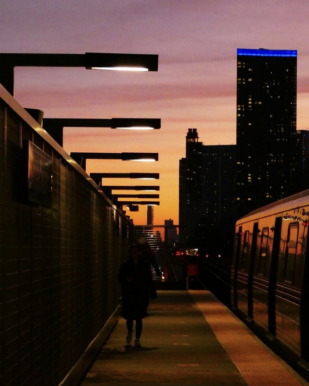

# Welcome to Subway Staffing (Lab #2)
## By Sidrat Habib
<br>


### Overview
This dashboard answers critical staffing questions for the NYC Transit Authority to help them prepare for the busy 2026 event season.


The goal is to identify mismatches between **demand (events + riders)** and **capacity (staffing + response time)** to recommend staffing improvements for Summer 2026. During this analysis we:


1. built upon importing data, and leveraged more than one dataset
2. explored more transforms with Observable Plot
3. iterated with visualizations to answer data questions
<br>


### Context
The NYC Transit Authority has collected operational data from their Manhattan subway stations and needs our help to make critical staffing decisions for next summer. They are planning for a busy event season in 2026 and want to ensure they have adequate staff at the right stations.


<br>


##### Photo Credits: Sidrat Habib
###### Fun Fact: The official MTA Instagram account reposted my photography to their feed. Here is the link: https://www.instagram.com/p/Cx_AeoMJDE2/


<!-- Import Data -->
```js
const incidents = FileAttachment("./data/incidents.csv").csv({ typed: true })
const local_events = FileAttachment("./data/local_events.csv").csv({ typed: true })
const upcoming_events = FileAttachment("./data/upcoming_events.csv").csv({ typed: true })
const ridership = FileAttachment("./data/ridership.csv").csv({ typed: true })
```

<!-- Include current staffing counts from the prompt -->
```js
const currentStaffing = {
  "Times Sq-42 St": 19,
  "Grand Central-42 St": 18,
  "34 St-Penn Station": 15,
  "14 St-Union Sq": 4,
  "Fulton St": 17,
  "42 St-Port Authority": 14,
  "Herald Sq-34 St": 15,
  "Canal St": 4,
  "59 St-Columbus Circle": 6,
  "125 St": 7,
  "96 St": 19,
  "86 St": 19,
  "72 St": 10,
  "66 St-Lincoln Center": 15,
  "50 St": 20,
  "28 St": 13,
  "23 St": 8,
  "Christopher St": 15,
  "Houston St": 18,
  "Spring St": 12,
  "Chambers St": 18,
  "Wall St": 9,
  "Bowling Green": 6,
  "West 4 St-Wash Sq": 4,
  "Astor Pl": 7
}
```
<br>
<br>

<style>
  .answer {
    background: linear-gradient(135deg, #f0f7ff, #f9fcff);
    border-radius: 14px;
    padding: 14px 16px;
    margin: 12px 0;
    font-size: 15px;
    line-height: 1.6;
    color: #1f2a44;
    max-width: 900px;
    box-shadow: 0 2px 8px rgba(0, 0, 0, 0.06);
    border: 1px solid #dbe8ff;
  }

  .answer strong {
    color: #2a6df4;
  }

  .answer::before {
    content: "Answer";
    display: block;
    font-size: 10px;
    font-weight: 700;
    letter-spacing: 0.08em;
    text-transform: uppercase;
    color: #2a6df4;
    margin-bottom: 6px;
  }
  .question {
    background: linear-gradient(135deg, #e8f1ff, #f4f8ff);
    border-radius: 14px;
    padding: 14px 16px;
    margin: 18px 0 10px 0;
    font-size: 20px;
    line-height: 1.6;
    color: #0f1f3d;
    max-width: 900px;
    border: 1px solid #c7dcff;
    box-shadow: 0 2px 8px rgba(0, 0, 0, 0.05);
    font-weight: 500;
  }

  .question::before {
    content: "Question";
    display: block;
    font-size: 10px;
    font-weight: 700;
    letter-spacing: 0.08em;
    text-transform: uppercase;
    color: #2a6df4;
    margin-bottom: 6px;
  }
</style>

## Part 1: Ridership Trends & Event Impacts

<div class="question"> How did local events impact ridership in summer 2025? What effect did the July 15th fare increase have?</div>
<div class="answer"> Local events generally cause short-term spikes in ridership at nearby stations, though the size of the increase depends on the event’s attendance. Larger events create noticeable peaks, while smaller events have minimal impact. After the July 15th fare increase of $2.75 to $3.00, ridership shows a slight overall decline across many stations, suggesting that higher fares may have reduced usage. </div> 
<br>

```js
const fareDate = new Date("2025-07-15");

// create station list
const stations = Array.from(new Set(ridership.map(d => d.station))).sort();

// dropdown
const selectedStation = view(Inputs.select(stations, { label: "Station", value: stations[0] }));

// filter ridership
const stationRidership = ridership.filter(d => d.station === selectedStation);

// event dates for that station
const stationEvents = local_events.filter(d => d.nearby_station === selectedStation);

display(
Plot.plot({
  width: 1000,
  height: 420,
  marginLeft: 80, // fixes cut-off y-axis labels
  x: { type: "time" },
  y: { label: "Entrances" },

  marks: [
    // background lines 
    Plot.lineY(ridership, {
      x: "date",
      y: "entrances",
      stroke: "#517dc3",   
      opacity: 0.5
    }),

    // selected station 
    Plot.lineY(
      ridership.filter(d => d.station === selectedStation),
      {
        x: "date",
        y: "entrances",
        stroke: "#1d4ed8", 
        strokeWidth: 3,
        tip: true
      }
    ),

    // event lines
    Plot.ruleX(
      local_events.filter(d => d.nearby_station === selectedStation),
      {
        x: "date",
        stroke: "#2563eb",
        strokeDasharray: "4,2",
        tip: true,
        channels: { Event: "event_name" }
      }
    ),

    // fare line
    Plot.ruleX([fareDate], {
      stroke: "#ef4444",
      strokeWidth: 2
    })
  ]
})
)
```
<br>
<br>

## Part 2: Emergency Response Performance by Station
<div class="question"> How do the stations compare when it comes to response time? Which are the best, which are the worst?</div>
<div class="answer"> Stations vary significantly in response times. Stations with shorter average response times can be considered the best performers, while those with longer times are the worst. The visualization shows a clear spread, with some stations consistently above the overall average, indicating slower emergency response and potential understaffing or operational inefficiencies. </div> 

```js
const stationOrder = Array.from(
  d3.rollup(
    incidents,
    v => d3.mean(v, d => d.response_time_minutes),
    d => d.station
  )
)
  .sort((a, b) => b[1] - a[1])
  .map(d => d[0]);

display(
Plot.plot({
  title: "Incident Response Times by Station",
  subtitle: "Average response time with distribution range (min → max)",
  marginLeft: 160,
  marginRight: 40,

  style: {
    background: "rgb(246, 188, 38)",
    color: "#0f172a",
    fontSize: "12px"
  },

  x: {
    label: "Response Time (minutes)",
    grid: true,
    tickFormat: ".1f"
  },

  y: {
    label: "Station",
    domain: stationOrder   
  },

  marks: [
    // range (min → max)
    Plot.ruleX(
      incidents,
      Plot.groupY(
        { x1: "min", x2: "max" },
        {
          x: "response_time_minutes",
          y: "station",
          stroke: "#1d4ed8",
          strokeWidth: 2,
          opacity: 0.5
        }
      )
    ),

    // mean point
    Plot.dot(
      incidents,
      Plot.groupY(
        { x: "mean" },
        {
          x: "response_time_minutes",
          y: "station",
          fill: "#1d4ed8",
          r: 5,
          tip: true
        }
      )
    )
  ]
})
)
```
<br>
<br>

## Part 3: Forecasted Staffing Requirements for 2026
<div class="question"> Which three stations need the most staffing help for next summer based on the 2026 event calendar? </div>
<div class="answer"> The three stations that need the most additional staffing are those with the largest increase in projected event-driven ridership from 2025 to 2026. These stations are Canal St, West 4 St-Wash Sq, and Time Sq-42 St. They show the greatest surge growth, meaning they will experience significantly higher traffic during events next summer. Since current staffing levels do not account for this increase, these stations are the highest priority for additional staff allocation. </div>

```js
// average daily ridership per station
const avgRidership = d3.rollup(
  ridership,
  v => d3.mean(v, d => d.entrances + d.exits),
  d => d.station
);

// compute surge ratios
const surge2025 = local_events.map(d => ({
  station: d.nearby_station,
  surge: d.estimated_attendance / (avgRidership.get(d.nearby_station) || 1)
}));

const surge2026 = upcoming_events.map(d => ({
  station: d.nearby_station,
  surge: d.expected_attendance / (avgRidership.get(d.nearby_station) || 1)
}));

// max surge per station
function summarize(data) {
  return Array.from(
    d3.rollup(
      data,
      v => d3.max(v, d => d.surge),
      d => d.station
    ),
    ([station, max]) => ({ station, max })
  );
}

const s2025 = summarize(surge2025);
const s2026 = summarize(surge2026);

// join datasets
const comparison = s2026.map(d => {
  const prev = s2025.find(p => p.station === d.station);
  return {
    station: d.station,
    surge2026: d.max,
    surge2025: prev ? prev.max : 0,
    increase: d.max - (prev ? prev.max : 0),
    staff: currentStaffing[d.station]
  };
});

// top 3 stations needing staffing
const topStations = comparison
  .sort((a, b) => b.increase - a.increase)
  .slice(0, 3);

display(
Plot.plot({
  width: 700,
  height: 420,
  marginLeft: 150,
  marginRight: 40,
  marginBottom: 50,

  title: "Top Stations Needing Staffing Support (2026 Forecast)",
  subtitle: "Ranked by increase in event-driven surge ratio from 2025 → 2026",

  style: {
    background: "rgb(246, 188, 38)",
    color: "#0f172a",
    fontSize: "12px"
  },

  x: {
    label: "Increase in Surge Ratio",
    grid: true,
    tickFormat: ".2f"
  },

  y: {
    label: "Station",
    domain: comparison
      .sort((a, b) => b.increase - a.increase)
      .map(d => d.station),
    labelOffset: 140
  },

  marks: [
    // baseline
    Plot.ruleX([0]),

    // main bars 
    Plot.barX(comparison, {
      x: "increase",
      y: "station",
      sort: { y: "-x" },
      fill: "#1d4ed8",
      opacity: 0.85
    }),

    // top 3 highlight 
    Plot.dot(topStations, {
      x: "increase",
      y: "station",
      r: 6,
      fill: "#01be5f",
      stroke: "#1e3a8a",
      strokeWidth: 1,
      tip: true
    })
  ]
})
)
```
<br>
<br>

## Bonus: Priority Staffing Recommendation

<div class="question">
If you had to prioritize one station to receive increased staffing, which would it be and why?
</div>
<div class="answer"> The highest priority station for additional staffing is <strong>${topStation.station}</strong>. This station shows the largest increase in projected event-driven ridership from 2025 to 2026, indicating it will experience the most significant growth in passenger volume during events. Given this sharp rise in demand, current staffing levels are unlikely to be sufficient to maintain efficient operations and quick incident response times. Prioritizing this station ensures resources are allocated where they will have the greatest impact on safety and service reliability. </div> 
<br>

```js
// pick the single station with the largest surge increase
const topStation = comparison
  .sort((a, b) => b.increase - a.increase)[0];

// sort stations by increase for better visual ranking
const ranked = [...comparison].sort((a, b) => b.increase - a.increase);

display(
Plot.plot({
  width: 700,
  height: 420,
  marginLeft: 150,
  marginRight: 40,
  marginBottom: 50,

  title: "NYC Station Surge Increase (2025 → 2026)",
  subtitle: "Ranked by projected event-driven ridership growth",

  style: {
    background: "rgb(246, 188, 38)",
    color: "#0f172a",
    fontSize: "12px"
  },

  x: {
    label: "Surge Increase",
    grid: true,
    tickFormat: "s"
  },

  y: {
    label: "Station",
    domain: ranked.map(d => d.station),
    labelOffset: 140,
  },

  marks: [
    // subtle grid reference line
    Plot.ruleX([0]),

    // lollipop sticks 
    Plot.ruleX(ranked, {
      x1: 0,
      x2: "increase",
      y: "station",
      stroke: "#1d4ed8",
      strokeWidth: 2,
      opacity: 0.8
    }),

    // station dots 
    Plot.dot(ranked, {
      x: "increase",
      y: "station",
      r: 6,
      fill: "#2563eb",
      stroke: "#1e3a8a",
      strokeWidth: 1,
      tip: true
    })
  ]
})
)
```