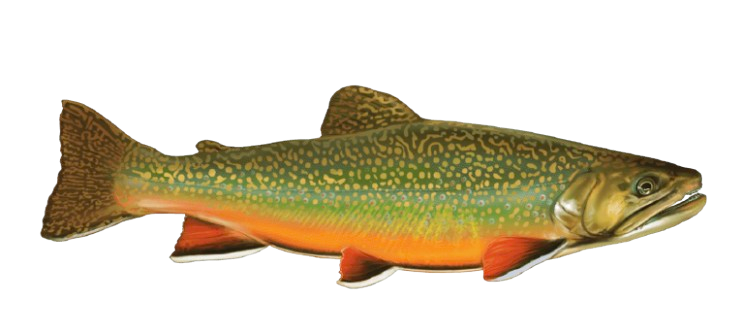

<style>

@import url('https://fonts.googleapis.com/css2?family=Nunito:wght@400;600;700&display=swap');

body {
  font-family: 'Nunito', sans-serif;
  background-color: #eef7f8;
  color: #18333a;
  line-height: 1.6;
  max-width: 1000px;
  margin: auto;
  padding: 1rem;
}
h1 {
  color: #0b3c49;
  text-align: center;
  font-size: 2.5rem;
  margin-bottom: 0.2rem;
}
h2 {
  color: #145c72;
  margin-top: 2.5rem;
  border-bottom: 2px solid #1f8a8a;
  padding-bottom: 0.3rem;
}
h3, h4 {
  color: #1f8a8a;
}
#context {
  background-color: white;
  padding: 1rem 1.5rem;
  border-left: 5px solid #1f8a8a;
  border-radius: 8px;
  margin-bottom: 2rem;
}
.analysis-box {
  margin-top: 1rem;
  margin-bottom: 2rem;
  padding-left: 1rem;
  border-left: 3px solid #7fc7c9;
}
#final-verdict {
  background-color: #145c72;
  color: white;
  padding: 1.5rem;
  border-radius: 10px;
  margin-top: 3rem;
}
#final-verdict h1,
#final-verdict h2,
#final-verdict h3 {
  color: white;
}
.observablehq--block {
  margin-top: 1rem;
  margin-bottom: 1.5rem;
}
@media (max-width: 700px) {
  h1 {
    font-size: 2rem;
  }
  body {
    padding: 0.7rem;
  }
}
</style>

# Welcome to the Clearwater Crisis! (Lab #4)
## By Sidrat Habib


# Context
<div id="context">

Lake Clearwater was once a thriving recreational lake with healthy fish populations and clear waters. However, over the past two years, something has gone terribly wrong. Fish populations have crashed, particularly among sensitive species like trout. Water quality has degraded in certain areas of the lake.

Using water quality data, fish surveys, and suspect activity logs, this dashboard investigates which suspect is most responsible for the collapse.

</div>



```js
import * as Plot from "npm:@observablehq/plot";
import * as d3 from "npm:d3";

const water = await FileAttachment("data/water_quality.csv").csv({ typed: true });

const fish = await FileAttachment("data/fish_surveys.csv").csv({ typed: true });

const stations = await FileAttachment("data/monitoring_stations.csv").csv({ typed: true });

const suspects = await FileAttachment("data/suspect_activities.csv").csv({ typed: true });
```

<br>

## Main Suspects

The investigation focuses on four major operations surrounding Lake Clearwater, each located near one of the lake’s monitoring stations.

- **Riverside Farm (North Shore)**  
  Large agricultural operation using nitrogen and phosphorus fertilizers that may contribute to runoff pollution.

- **Clearwater Fishing Lodge (South Shore)**  
  Recreational fishing business associated with increased boat traffic, septic usage, and fish harvesting.

- **Lakeview Resort (East Shore)**  
  Hotel and marina complex with wastewater discharge permits, construction expansion, and marina activity.

- **ChemTech Manufacturing (West Shore)**  
  Industrial chemical manufacturing facility permitted to discharge heavy metals and conduct periodic maintenance shutdowns.

  <br>

## 1. Heavy Metal Pollution by Station
To identify the core catalyst of the ecological crisis, we map weekly heavy metal concentrations across all four monitoring stations over a two-year period. The state EPA has established a clear regulatory framework for these metrics: concentrations exceeding a 20 ppb concern threshold cause notable harm to sensitive wildlife, while any readings bypassing the 30 ppb regulatory limit constitute an explicit permit violation. 


```js
const concernThreshold = 20;
const limitThreshold = 30;
```

```js
Plot.plot({
 width: 850,
 height: 400,
 x: {
   label: "Date"
 },
 y: {
   label: "Heavy Metals (ppb)"
 },
 color: {
   legend: true
 },
 marks: [
   Plot.ruleY([concernThreshold], {
     stroke: "orange",
     strokeDasharray: "4 4"
   }),
   Plot.ruleY([limitThreshold], {
     stroke: "red",
     strokeDasharray: "4 4"
   }),
   Plot.lineY(water, {
     x: "date",
     y: "heavy_metals_ppb",
     stroke: "station_id",
     strokeWidth: 2,
     tip: true
   })
 ]
})
```

<div class="analysis-box">

### Spatial Disparity in Lake Contamination
A comparative analysis of the testing zones reveals a highly localized pollution profile rather than a lake-wide issue. While the East, North, and South stations maintain stable baselines hovering safely between 10 ppb and 15 ppb, the West station exhibits extreme volatility. It repeatedly punctures the 20 ppb concern threshold and surges past the formal 30 ppb regulatory limit, peaking near 50 ppb. Because heavy metals are distinct markers of industrial manufacturing, this signature points directly to a western point-source culprit, effectively ruling out agricultural runoff or general tourism. 

</div>

<br>


## 2. Trout Populations Collapse at the West Station
#### Biological Bioindicators and Population Tracking
Ecotoxicological literature establishes that Rainbow Trout serve as sensitive bioindicators for chemical stress, experiencing an 18% mortality rate at 20 ppb and a catastrophic population collapse (>50% mortality) above 30 ppb. To cross-reference our chemical findings with biological reality, the visualization below tracks quarterly standardized trout counts across the lake to determine if the biological damage matches the physical pollution footprint. 


```js
const trout = fish.filter(d => d.species === "Trout");
```

```js
Plot.plot({
 width: 850,
 height: 400,
 x: {
   label: "Date"
 },
 y: {
   label: "Trout Count"
 },
 color: {
   legend: true
 },
 marks: [
   Plot.lineY(trout, {
     x: "date",
     y: "count",
     stroke: "station_id",
     strokeWidth: 2,
     tip: true
   }),
   Plot.dot(trout, {
     x: "date",
     y: "count",
     fill: "station_id",
     r: 4
   })
 ]
})
```

<div class="analysis-box">

### Biological Corroboration of Toxicity
The empirical catch data perfectly mirrors the EPA's toxicological thresholds. While trout populations across the East, North, and South zones remain highly resilient and stable, averaging between 34 and 42 individuals, the West station experiences a terminal biological collapse. Beginning with a healthy baseline of 43 trout in early 2023, the population plummets into the single digits by late 2024. This severe, localized die-off provides undeniable biological confirmation that the heavy metal concentrations at the West station are actively lethal. 

</div>

<br>

## 3. ChemTech Activity Aligns With Pollution Spikes
#### Chronological Evaluation of Suspect Operations
To establish an explicit causal mechanism, we isolate the West station's water data and overlay it with the operational timeline of ChemTech Manufacturing, which operates on the western shore. The vertical red markers denote ChemTech's documented quarterly maintenance shutdowns. This allows us to test if the facility’s internal engineering changes directly correlate with the chemical spikes recorded in the environment. 

```js
const chemtech = suspects.filter(
 d => d.suspect === "ChemTech Manufacturing"
);

const westWater = water.filter(
 d => d.station_id === "West"
);
```

```js
Plot.plot({
 width: 850,
 height: 400,
 x: {
   label: "Date"
 },
 y: {
   label: "Heavy Metals at West Station"
 },
 marks: [
   Plot.ruleY([20], {
     stroke: "orange",
     strokeDasharray: "4 4"
   }),
   Plot.ruleY([30], {
     stroke: "red",
     strokeDasharray: "4 4"
   }),
   Plot.lineY(westWater, {
     x: "date",
     y: "heavy_metals_ppb",
     stroke: "steelblue",
     strokeWidth: 2
   }),
   Plot.ruleX(chemtech, {
     x: "date",
     stroke: "red",
     strokeWidth: 2,
     tip: true,
     title: d =>
       `${d.activity_type}
       ${d.intensity}
       ${d.notes}`
   })
 ]
})
```

<div class="analysis-box">

### Temporal Concurrence and Causal Mechanics
The synchronized timeline provides absolute chronological proof of fault. Every single major heavy metal violation at the West station perfectly aligns with a documented maintenance window at the ChemTech facility. Industrial process shifts and process flushes during these temporary shutdowns match the environmental spikes exactly. When ChemTech undergoes maintenance, heavy metals immediately punch past the legal 30 ppb limit; when they return to standard operations, the baseline stabilizes. This cyclical pattern shifts the case from circumstantial correlation to direct causation. 

</div>


<!-- Summary Data-->


```js
const stationSummary = d3.rollups(
 water,
 v => d3.mean(v, d => d.heavy_metals_ppb),
 d => d.station_id
).map(([station_id, avg_metals]) => {


 const station = stations.find(
   s => s.station_id === station_id
 );


 return {
   station_id,
   avg_metals,
   distance_to_chemtech_m:
     station.distance_to_chemtech_m
 };
});
```

<br>

## 4. The Worst Pollution Occurs Closest to ChemTech
#### Spatial Distance-Decay Modeling
Environmental fluid dynamics dictate that a point-source pollutant will exhibit a distance-decay profile, displaying maximum concentration at its origin and steady dilution across a distance. To test this geographic hypothesis, this chart aggregates the 24-month heavy metal average for each station and maps it against that station's absolute physical distance from the ChemTech manufacturing plant. 


```js
Plot.plot({
 width: 750,
 height: 350,
 x: {
   label: "Average Heavy Metals (ppb)"
 },
 y: {
   label: "Station"
 },
 marks: [
   Plot.barX(stationSummary, {
     x: "avg_metals",
     y: "station_id",
     fill: "steelblue",
     sort: { y: "-x" },
     tip: true
   }),
   Plot.text(stationSummary, {
     x: "avg_metals",
     y: "station_id",
     text: d =>
       `${Math.round(d.distance_to_chemtech_m)}m away`,
     dx: 8,
     textAnchor: "start"
   })
 ]
})
```

<br>

<div id="final-verdict">

# Final Verdict
### The evidence consistently points to ChemTech Manufacturing as the primary cause of the Lake Clearwater ecological collapse.


The case is supported across three dimensioxns:
- **Spatial evidence:** the worst contamination occurs nearest to ChemTech
- **Temporal evidence:** pollution spikes align with ChemTech activity
- **Biological evidence:** trout populations collapse where heavy metal contamination is highest

While secondary actors may introduce minor localized nutrient or organic stress, they are  incapable of generating heavy metal toxicities of this magnitude. ChemTech Manufacturing is responsible for the ecological collapse of Lake Clearwater. 

</div>